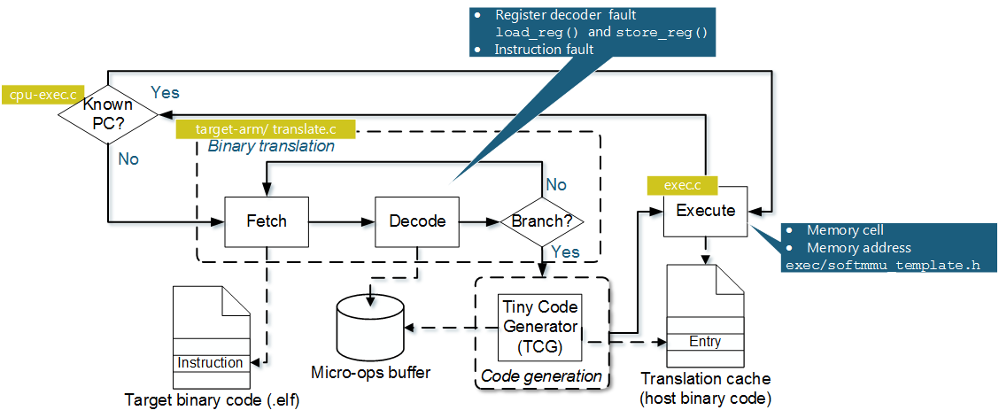

FIES - Fault Injection for Evaluation of Software-based fault tolerance
==========================================================================

FIES is a QEMU fault injection extension.
 
The following picture shows the main points, where FIES takes action during an QEMU binary translation:


The working principle of FIES is described in the following publications:
* A. Höller, G. Schönfelder, N. Kajtazovic, T. Rauter, and C. Kreiner, “FIES: A Fault Injection Framework for the Evaluation of Self-Tests for COTS-Based Safety-Critical Systems,” in 15th IEEE International Microprocessor Test and Verification Workshop (MTV), 2014, vol. 2015-April, pp. 105–110.
* A. Höller, G. Macher, T. Rauter, J. Iber, and C. Kreiner, “A Virtual Fault Injection Framework for Reliability-Aware Software Development,” in IEEE/IFIP International Conference on Dependable Systems and Networks Workshops (DSN-W), 2015, pp. 69 – 74.
* A. Höller, A. Krieg, T. Rauter, J. Iber, and C. Kreiner, “QEMU-Based Fault Injection for a System-Level Analysis of Software Countermeasures Against Fault Attacks,” in 18th Euromicro Conference on Digital System Design (DSD), 2015, pp. 530 – 533.

Building FIES
--------------

* Install required libraries: libffi, libiconv, gettext, python, pkg-config, glib, sdl, zlib, pixman, libfdt, libxml2
  For detailed information about QEMU-required packages see http://wiki.qemu.org/Hosts/Linux . Additionally FIES requires `libxml2`.

* Configure and build FIES
```splus
CF=$(xml2-config --cflags)
LF=$(xml2-config --libs)
./configure --target-list=arm-softmmu --extra-cflags="$CF" --extra-ldflags="$LF" --enable-sdl 
cd pixman
./configure
cd ..
make
```

Using FIES
-----------

### Example files
For illustration we created a simple hello-world app and exemplary fault libraries in the folder `fies_sandbox`

### Compiling for FIES
Currently, FIES supports only ARM architectures. Thus, to compile an application that should be simulated with FIES compile it for ARM.

GCC example:
```splus
arm-none-eabi-gcc -marm *.c --specs=nosys.specs
```

Clang example:
```splus
clang -target arm -marm *.c 
```

If you use Code Sourcery use the following settings (C/C++ Build > Tool Settings)
* Board: QEMU ARM Simulator (VFP)
* Profile: Simulator
* Hosting: Hosted

### Execute an Application without Fault Injection (for Golden Runs)
Start the application the same way as you start a normal QEMU emulation (see http://wiki.qemu.org/download/qemu-doc.html#pcsys_005fquickstart)
Hint: to pass arguments use the `-append` flag

```splus
arm-softmmu/qemu-system-arm -semihosting -kernel <binary>
```

### Application Profiling
Use the `-profiling` flag to record register and memory usage

Options:
* `m` profile memory usage
* `r` profile register usage

Results are stored in `profiling_meory.txt` or/and `profiling_registers.txt`

Example:
```splus
arm-softmmu/qemu-system-arm -semihosting -kernel <binary> -profiling rm
```

### Start Fault Injection
#### Define Fault Library
Faults that should be injected are described in an XML file.

XML fault lib example:
```splus
<?xml version="1.0" encoding="UTF-8"?>
<injection>
	<fault>
		<id>1</id>
		<component>RAM</component>
		<target>MEMORY CELL</target>
		<mode>SF</mode>
		<trigger>ACCESS</trigger>
		<type>PERMANENT</type>
		<params> 
			<address>0x07FFFFDC</address>
			<mask>0xFF</mask>
			<set_bit>0xFF</set_bit>
		</params>
	</fault>
</injection>
```

XML Fields:
* `<fault>`: Defines start and end of fault description. Multiple faults are injected concurrently if multiple fault descriptions are provided.
* `<id>`: Defines fault ID
* `<component>`: `CPU`, `RAM`, or `REGISTER`
* `<target>`:
  * for `CPU` faults: `INSTRUCTION DECODER`, `INSTRUCTION EXECUTION`, or `CONDITION FLAGS`
  * for `REGISTER` faults: `ADDRESS DECODER`, `REGISTER CELL`
  * for `RAM` faults: `ADDRESS DECODER`, `MEMORY CELL`
* `<mode>`: Defines the fault mode
  * Condition flags: `VF`, `ZF`, `CF`, `NF`, `QF`
  * General fault modes: `NEW VALUE`, `SF`, `BIT-FLIP`
  * Operation-dependent static faults: `TF0`, `TF1`, `WDF0`, `WDF1`, `IRF0`, `IRF1`,
`DRDF0`, `DRDF1`, `RDF0`, `RDF1`
  * Operation-dependent dynamic faults: `RDF00`, `RDF01`, `RDF10`, `RDF11`, `IRF00`, `IRF01`, `IRF10`, `IRF11`, `DRDF00`, `DRDF01`, `DRDF10`, `DRDF11`
  * Coupling faults: `CFST00`, `CFST01`, `CFST10`, `CFST11`, `CFTR00`, `CFTR01`, `CFTR10`, `CFTR11`, `CFWD00`, `CFWD01`, `CFWD10`, `CFWD11`, `CFRD00`, `CFRD01`, `CFRD10`, `CFRD11`, `CFIR00`, `CFIR01`, `CFIR10`, `CFIR11`, `CFDR00`, `CFDR01`, `CFDR10`, `CFDR11`, `CFDS0W00`, `CFDS0W01`, `CFDS0W10`, `CFDS0W11`, `CFDSW00`, `CFDS1W01`, `CFDS1W10`, `CFDS1W11`, `CFDS0R00`, `CFDS0R01`, `CFDS0R10`, `CFDS1R11`
* `<trigger>`: `ACCESS`, `TIME`, `PC`
* `<type>`: `TRANSIENT`, `PERMANENT`, `INTERMITTEND`
* `<duration>`: duration for intemittend and transient faults in ms (e.g. `10MS`)
* `<interval>`: interval for intermittent faults in ms (e.g. `10MS`)
* `<params>`: parameter descriptions to specify fault mode
  *`<address>`: register or memory address
  *`<mask>`: mask for the position where fault should be active (e.g. to inject fault in last bit `0x1`), or new value definition in `NEW VALUE` mode
  *`<cf_address>`: coupling addrsss for coupling faults
  *`<instruction>`: instruction number that should be replaced for `CPU INSTRUCTION DECODER` faults 
  *`<set_bit>`: mask to select if bits defined in `<mask>` should be set (e.g. `0x1` for SAF-1) or resetted (e.g. `0x0` for SAF-0). Aggressor-bit mask for intercoupling faults.

#### Execute software and inject fault
Use the `-fi` flag to give the fault library and start FIES with fault injection

```splus
arm-softmmu/qemu-system-arm -semihosting -kernel <binary> -fi <fault-lib.xml>
```

See `fies.log` for error messages
